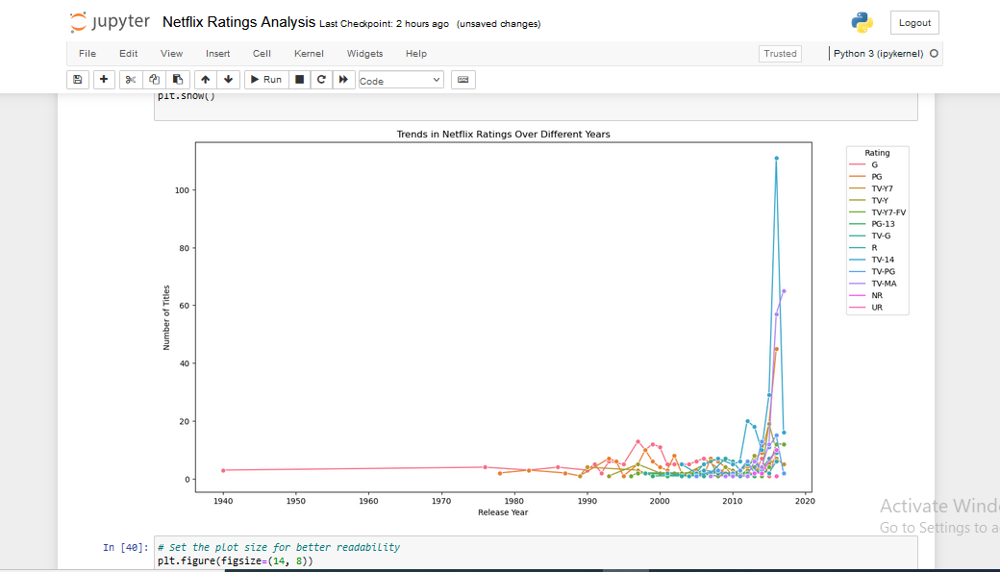
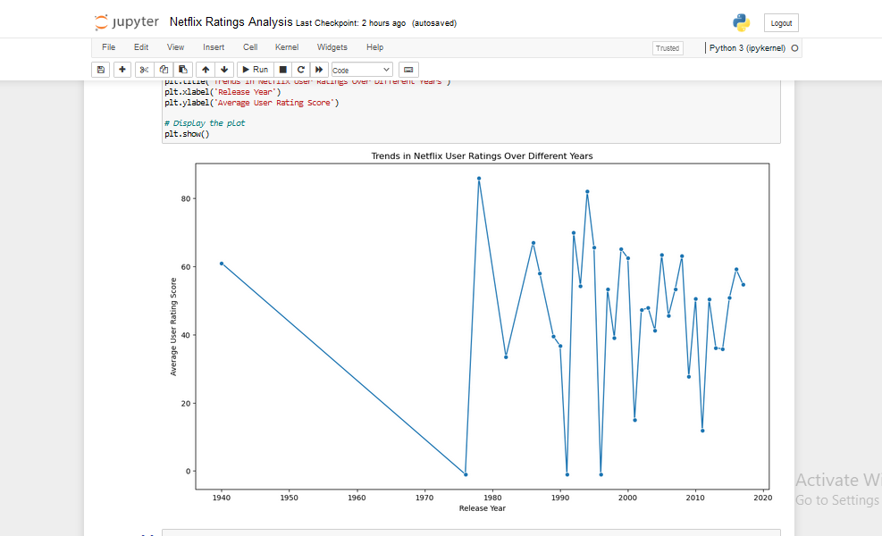

# Analyzing Trends in Netflix Content Ratings and User Ratings Over Time

## Overview
This project analyzes Netflix movie and TV show ratings, focusing on trends over different decades. It explores how content ratings have evolved, how user ratings fluctuate over time, and the correlation between different rating types and user satisfaction.

## Dataset
The dataset includes information on Netflix titles, including title, rating, rating level, rating description, release year, user rating score, and user rating size.

## Tools and Libraries
- Python
- Pandas
- Seaborn
- Matplotlib

## Key Insights
- *Increase in TV-MA Content*: Indicates a shift towards more mature themes.
- *Popularity of PG-13 and TV-14 Ratings*: Shows Netflix's focus on family-friendly content.
- *User Rating Fluctuations*: Reflect dynamic viewer reception.
- *Higher Ratings in Late 2010s*: Suggest improved content quality.
- *Diverse Reception of Mature Content*: Versus consistent ratings for family content.

## Visualizations
### Trends in Netflix Ratings Over Different Years

### Trends in Netflix User Ratings Over Different Years

## Contributions
Contributions are welcome! Please open an issue or submit a pull request.
